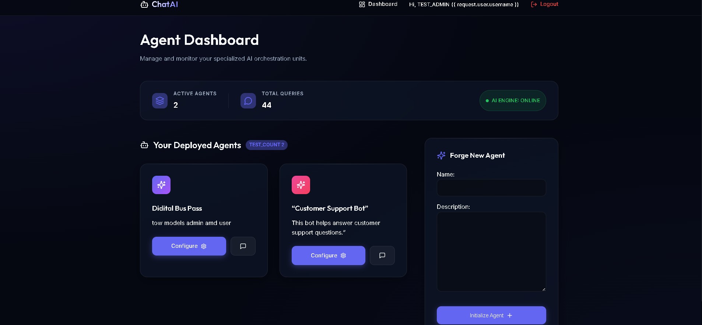

# Chatbot Platform (Django + OpenRouter API)

A sophisticated chatbot platform where users can register, create AI agents, manage system prompts, and interact with a memory-aware AI model powered by OpenRouter.

---

## 1️⃣ Project Overview
This project is a full-stack Django application designed to provide a seamless interface for interacting with LLMs (Large Language Models). It allows users to create isolated "Projects," each with its own identity, knowledge base, and conversation history. The platform is optimized for performance and features a high-end "Glassmorphism" UI.

## 2️⃣ Features
- **User Authentication**: Secure registration and login using Django's standard auth system.
- **Agent Orchestration**: Create multiple AI agents with unique names and descriptions.
- **Prompt Engineering**: Add and maintain versioned system prompts to define agent personalities.
- **Knowledge Base (RAG Ready)**: Upload files and documents for agents to reference during interactions.
- **Smart Conversation**: Context-aware chat that remembers the last 10 messages.
- **Premium Dark UI**: A vibrant, modern interface with Lucide icons and smooth animations.
- **API Resilience**: Integrated timeout handling and fallback "Mock Mode" for testing without keys.

## 3️⃣ System Architecture
The platform follows a standard MVC (Model-View-Controller) pattern adapted for Django's MVT (Model-View-Template):
- **Models**: Handles users, projects, prompts, chat history, and file metadata.
- **Views**: Orchestrates the communication between the UI and the OpenRouter API.
- **LLM Integration**: Asynchronous-style API calls to OpenRouter for low-latency responses.
- **Persistence**: MySQL database for storing all user configuration and chat logs.

## 4️⃣ Tech Stack
| Component | Technology |
|----------|------------|
| **Backend** | Django 6.0 (Python 3.11+) |
| **Frontend** | Vanilla HTML5, Premium CSS (Glassmorphism), JavaScript (ES6) |
| **Icons** | Lucide Icons |
| **Database** | MySQL |
| **AI Engine** | OpenRouter API (Mistral 7B / Llama 3.1) |

## 5️⃣ Installation Steps
### 1. Clone the repository
```bash
git clone https://github.com/your-username/chatbot_platform.git
cd chatbot_platform
```

### 2. Install dependencies
```bash
pip install -r requirements.txt
```

### 3. Setup Environment
Create a `.env` file in the root directory:
```env
OPENROUTER_API_KEY=your_key_here
```

## 6️⃣ Running the Project
### 1. Initialize Database
```bash
python manage.py makemigrations
python manage.py migrate
```

### 2. Launch Server
```bash
python manage.py runserver
```
Visit `http://127.0.0.1:8000` to start building.

## 7️⃣ API Integration (OpenRouter)
The platform uses a robust integration with OpenRouter's completions endpoint:
```python
def get_ai_response(message, system_prompt=None, history=None):
    url = "https://openrouter.ai/api/v1/chat/completions"
    headers = {
        "Authorization": f"Bearer {settings.OPENROUTER_API_KEY}",
        "Content-Type": "application/json",
        "HTTP-Referer": "http://localhost:8000"
    }
    # ... message assembly logic ...
    response = requests.post(url, headers=headers, json=data, timeout=20)
    return response.json()["choices"][0]["message"]["content"]
```

## 8️⃣ Screenshots
### Dashboard Overview


### Agent Configuration & Knowledge Base
    

### Interactive Chat Interface


## 9️⃣ Folder Structure
```text
chatbot_platform/
├── api/                       # Core application logic
│   ├── models.py              # User, Project, Chat, and File models
│   ├── views.py               # AI integration and page logic
│   ├── urls.py                # App-level routing
│   └── templates/             # App-level templates (chat, dashboard, etc.)
├── chatbot_platform/          # Project configuration
│   ├── settings.py            # Global settings and DB config
│   ├── urls.py                # Main project routing
├── static/                    # Global assets
│   └── css/                   # Premium Glassmorphism styles
└── templates/                 # Global layout templates (base.html)
```

## 🔟 Future Enhancements
- **Advanced RAG**: Full-text search and vector embedding for uploaded files.
- **Multi-Model Support**: User-selectable AI models per project.
- **Analytics Dashboard**: Track API usage and response tokens.
- **OAuth Integration**: "Sign in with Google" support.

## 1️⃣1️⃣ Author Details
- **Author**: Nandeesha M
- **Role**: BCA Student / Aspiring AI Developer
- **Project**: AI Chatbot Management Platform (2026)

---
© 2026 Nandeesha M - Crafted for Excellence.
